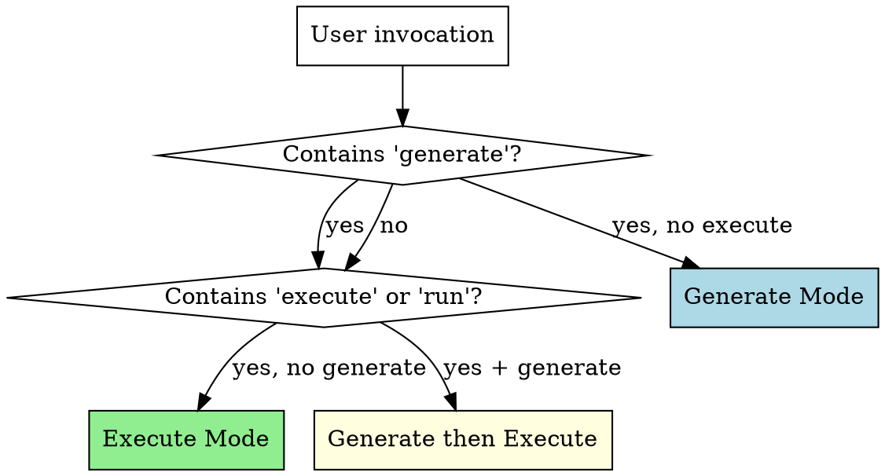

# Delphi

*The Oracle that foresees all outcomes.*

## Overview

Delphi generates comprehensive test scenarios — **guided cases** — for any software. It analyzes code, docs, specs, and running apps to produce structured Markdown test cases covering positive, negative, edge, accessibility, and security paths. Cases serve two audiences: human testers who walk through them step-by-step, and AI agents who execute them automatically.

**Core principle:** Exhaustive by default. Generate ALL scenarios. Users scope down, never up.

**Two modes:**
- **Generate** — analyze project context, discover testable surfaces, produce guided cases
- **Execute** — read generated cases, run them via browser automation or programmatic verification

## Mode Detection



| Invocation Pattern | Mode |
|-------------------|------|
| "Generate guided cases for X" | Generate |
| "Write test scenarios for X" | Generate |
| "Execute guided cases" / "Run guided cases" | Execute |
| "Test the guided cases" | Execute |
| "Generate and execute guided cases" | Generate, then Execute |
| Pipeline trigger (post-build) | Generate (+ Execute if browser available) |
| No guided cases exist yet + user says "test this" | Generate first, ask about Execute |

**Default behavior:** If guided cases don't exist yet, always Generate first. If they exist and user says "test" or "run", Execute.

## Guided Case Format

Every guided case MUST follow this exact template:

~~~markdown
# GC-XXX: [Descriptive Scenario Title]

## Metadata
- **Type**: positive | negative | edge | accessibility | performance | security
- **Priority**: P0 | P1 | P2
- **Surface**: ui | api | cli | background
- **Flow**: [logical flow name, e.g., "authentication", "checkout"]
- **Tags**: [comma-separated searchable tags]
- **Generated**: YYYY-MM-DD
- **Last Executed**: YYYY-MM-DD | never

## Preconditions

Bullet list of what must be true before this case starts. Each must be verifiable.

## Steps

Numbered steps. Each step has:
1. [Action description — what to do]
   - **Target**: [where — URL, element description, endpoint, command]
   - **Input** (if applicable): [what data to provide]
   - **Expected**: [what should happen — one or more expected outcomes]

## Success Criteria
- [ ] [Condition that must be true for this case to pass]

## Failure Criteria
- [Any ONE of these being true means the case failed]

## Notes
Optional. Known issues, environment requirements, things to watch for.
~~~

**Case ID convention:** `GC-XXX` — zero-padded sequential number, unique across the project.

**File naming:** `gc-XXX-short-description.md` — lowercase, hyphens, in a flow-specific subdirectory.

**Directory structure:**
```
tests/guided-cases/
  index.md
  [flow-name]/
    gc-001-description.md
    gc-002-description.md
```
