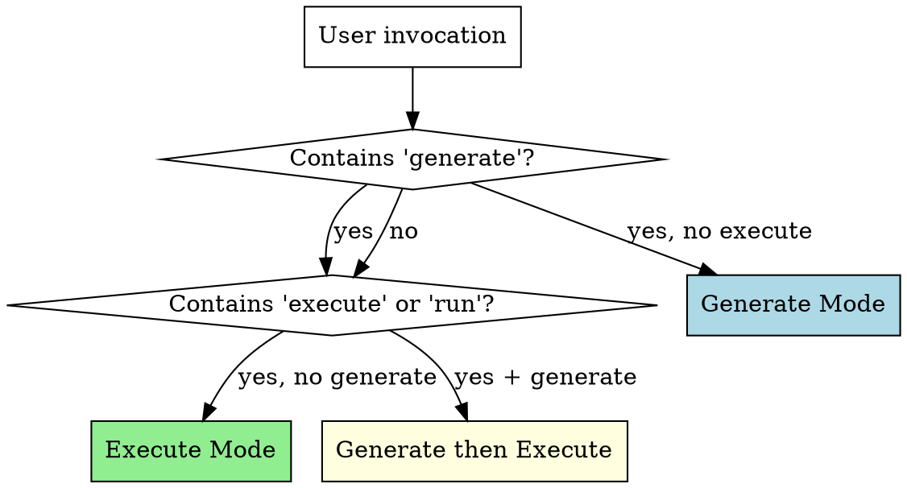
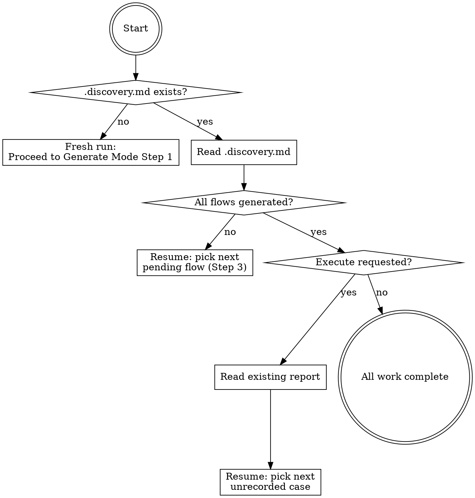

# Delphi

*The Oracle that foresees all outcomes.*

## Overview

Delphi generates comprehensive test scenarios — **guided cases** — for any software. It analyzes code, docs, specs, and running apps to produce structured Markdown test cases covering positive, negative, edge, accessibility, and security paths. Cases serve two audiences: human testers who walk through them step-by-step, and AI agents who execute them automatically.

**Core principle:** Exhaustive by default. Generate ALL scenarios. Users scope down, never up.

**Two modes:**
- **Generate** — analyze project context, discover testable surfaces, produce guided cases
- **Execute** — read generated cases, run them via browser automation or programmatic verification

## Mode Detection



| Invocation Pattern | Mode |
|-------------------|------|
| "Generate guided cases for X" | Generate |
| "Write test scenarios for X" | Generate |
| "Execute guided cases" / "Run guided cases" | Execute |
| "Test the guided cases" | Execute |
| "Generate and execute guided cases" | Generate, then Execute |
| Pipeline trigger (post-build) | Generate (+ Execute if browser available) |
| No guided cases exist yet + user says "test this" | Generate first, ask about Execute |

**Default behavior:** If guided cases don't exist yet, always Generate first. If they exist and user says "test" or "run", Execute.

## Resume Protocol

Every Delphi invocation starts here. Check disk state before doing any work.



**On fresh run:** No `.discovery.md` exists — proceed normally to Generate Mode Step 1.

**On resume (generate):** Read `.discovery.md`, find first flow with status `pending` or `in_progress`, skip to Generate Mode Step 3 for that flow.

**On resume (execute):** Read `.discovery.md` and existing report file, identify cases not yet recorded in the report, skip to Execute Mode Step 3 for the next unrecorded case.

**Key rule:** Never re-do completed work. If a flow is marked `done`, skip it. If a case has a result in the report, skip it.

## Guided Case Format

Every guided case MUST follow this exact template:

~~~markdown
# GC-XXX: [Descriptive Scenario Title]

## Metadata
- **Type**: positive | negative | edge | accessibility | performance | security
- **Priority**: P0 | P1 | P2
- **Surface**: ui | api | cli | background
- **Flow**: [logical flow name, e.g., "authentication", "checkout"]
- **Tags**: [comma-separated searchable tags]
- **Generated**: YYYY-MM-DD
- **Last Executed**: YYYY-MM-DD | never

## Preconditions

Bullet list of what must be true before this case starts. Each must be verifiable.

## Steps

Numbered steps. Each step has:
1. [Action description — what to do]
   - **Target**: [where — URL, element description, endpoint, command]
   - **Input** (if applicable): [what data to provide]
   - **Expected**: [what should happen — one or more expected outcomes]

## Success Criteria
- [ ] [Condition that must be true for this case to pass]

## Failure Criteria
- [Any ONE of these being true means the case failed]

## Notes
Optional. Known issues, environment requirements, things to watch for.
~~~

**Case ID convention:** `GC-XXX` — zero-padded sequential number, unique across the project.

**File naming:** `gc-XXX-short-description.md` — lowercase, hyphens, in a flow-specific subdirectory.

**Directory structure:**
```
tests/guided-cases/
  index.md
  [flow-name]/
    gc-001-description.md
    gc-002-description.md
```

---

## Generate Mode

Follow these steps in order. Do NOT skip steps. Do NOT start writing cases before completing surface discovery.

### Step 1: Context Gathering

Collect all available project context. Use these exact searches:

**Code structure:**
- Routes/pages: Glob for `**/pages/**`, `**/routes/**`, `**/app/**/page.*`, `**/app/**/layout.*`, `**/*router*`
- Components: Glob for `**/components/**/*.{tsx,jsx,vue,svelte,html}`
- API handlers: Glob for `**/api/**/*.{ts,js,py,go,rs}`, `**/controllers/**`, `**/handlers/**`, `**/routes/**/*.{ts,js}`
- CLI entry points: Glob for `**/bin/**`, `**/cli/**`, `**/commands/**`, `**/*cli*.*`
- Models/schemas: Glob for `**/models/**`, `**/schemas/**`, `**/types/**`, `**/entities/**`
- Config: Glob for `**/.env*`, `**/config/**`, `**/next.config*`, `**/vite.config*`, `**/tsconfig*`

**Documentation:**
- Read if they exist: `README.md`, `CLAUDE.md`, `docs/**/*.md`, `*.md` in project root
- API docs: `openapi.yaml`, `openapi.json`, `swagger.yaml`, `swagger.json`
- Design docs: `docs/plans/**/*.md`

**Recent changes:**
- Run: `git log --oneline -20` to see what was recently built
- Run: `git diff --stat HEAD~5` to see what files changed recently

**Existing test coverage:**
- Glob for `**/*.test.*`, `**/*.spec.*`, `**/tests/**`, `**/__tests__/**`, `**/test/**`
- Read a few test files to understand what's already covered

**Running app detection (if applicable):**
- Check common ports: `curl -s -o /dev/null -w "%{http_code}" http://localhost:3000` (also try 3001, 5173, 8080, 8000, 4200)
- If Chrome MCP tools are available AND app is running, navigate to it and take a screenshot for visual context

**User-provided context:**
- If the user specified a scope (e.g., "generate cases for auth"), focus context gathering on that area
- If the user provided docs or specs, read those first

After gathering, mentally summarize: what surfaces exist, what flows they form, and what's already tested.

### Step 2: Surface Discovery

From gathered context, build a surface map.

**Enumerate every testable surface:**

| Surface Type | How to Find | Example |
|-------------|-------------|---------|
| UI pages | Routes, page files, navigation components | `/login`, `/dashboard`, `/settings` |
| API endpoints | Route handlers, controller files, OpenAPI spec | `POST /api/auth/login`, `GET /api/users` |
| CLI commands | bin/ files, command handlers, --help output | `myapp init`, `myapp deploy --env prod` |
| Background jobs | Queue workers, cron configs, webhook handlers | `processPayments`, `sendEmailDigest` |

**Group surfaces into flows:**

A flow is a logical user journey that spans one or more surfaces. Examples:
- **authentication**: login page (UI) + `/api/auth/login` (API) + session management (background)
- **user-management**: settings page (UI) + `/api/users` (API) + profile update
- **checkout**: cart page → payment page → confirmation page (UI) + payment API + order processing (background)

Each surface can belong to multiple flows.

**Present the surface map to the user:**

After discovery, show the user what you found:

> **Surface Map:**
>
> **authentication** (3 surfaces)
> - UI: `/login`, `/register`, `/forgot-password`
> - API: `POST /api/auth/login`, `POST /api/auth/register`, `POST /api/auth/reset`
>
> **dashboard** (2 surfaces)
> - UI: `/dashboard`
> - API: `GET /api/stats`, `GET /api/recent-activity`
>
> [etc.]
>
> Should I generate guided cases for all flows, or focus on specific ones?

**Wait for user confirmation before proceeding to Step 3.** The user may want to scope down to specific flows.

### Step 3: Case Generation

For each confirmed flow, generate guided cases using this coverage matrix:

| Dimension | What to Generate | Default Priority |
|-----------|-----------------|-----------------|
| **Happy path** | One end-to-end successful flow | P0 |
| **Input validation** | One case per validation rule per input field (empty, too long, wrong format, special chars) | P1 |
| **Boundary values** | Empty state, single item, min value, max value, just-over-max | P1 |
| **Auth/permissions** | Authorized access for each role + unauthorized denial for each role | P0 |
| **Error states** | Network failure, server 500, timeout, 404 not found, malformed response | P0 |
| **State transitions** | Back button mid-flow, refresh mid-flow, navigate away and return, stale data | P1 |
| **Empty/first-use states** | No data yet, first-time user, cleared/deleted data | P1 |
| **Accessibility** | Keyboard-only navigation, tab order, focus management, screen reader labels | P2 |
| **Concurrency** | Double-click submit, duplicate form submission, race conditions | P1 |
| **Security** | XSS in text inputs, SQL injection in search, CSRF, auth bypass, session fixation | P0 |

**For API surfaces, also add:**

| Dimension | What to Generate | Default Priority |
|-----------|-----------------|-----------------|
| **Valid request** | Correct payload, correct headers, expected response | P0 |
| **Missing required fields** | Omit each required field one at a time | P1 |
| **Invalid types** | String where number expected, null where required, array where object expected | P1 |
| **Oversized payloads** | Very long strings, very large numbers, deeply nested objects | P2 |
| **Auth variations** | No token, expired token, wrong role token, valid token | P0 |

**For CLI surfaces, also add:**

| Dimension | What to Generate | Default Priority |
|-----------|-----------------|-----------------|
| **Valid usage** | Correct command with expected flags | P0 |
| **Missing required args** | Omit each required argument | P1 |
| **Invalid flags** | Unknown flags, wrong flag types, conflicting flags | P1 |
| **Help text** | `--help` outputs accurate, complete documentation | P1 |

**Generation rules:**
1. Use the EXACT guided case template from the "Guided Case Format" section above
2. Every case gets a unique `GC-XXX` ID, sequential across the project
3. Be SPECIFIC in steps — name exact URLs, exact button text, exact field names, exact API endpoints, exact commands
4. Include realistic test data in steps (not placeholders like "enter a value")
5. Each case tests ONE scenario — don't combine multiple scenarios in one case
6. Write expected outcomes that are observable and verifiable (not vague like "page works correctly")

### Step 4: Priority Assignment

Review generated cases and assign priorities:

- **P0 (Critical)**: Must work or the software is broken. Happy paths, authentication, security, critical error handling. If this fails, users can't use the core functionality or data is at risk.
- **P1 (Important)**: Should work for a good user experience. Validation, boundary values, state transitions, concurrency. If this fails, users hit rough edges but core functionality works.
- **P2 (Nice-to-have)**: Ideal to work. Accessibility, cosmetic issues, rare edge cases, oversized payloads. If this fails, some users are affected in specific situations.

The coverage matrix above provides default priorities. Override when the specific context warrants it (e.g., if the app is a banking app, all security cases are P0).

### Step 5: Write Output

1. **Create directory structure:**
   ```
   tests/guided-cases/
     [flow-name]/          # one directory per flow (lowercase, hyphenated)
       gc-001-description.md
       gc-002-description.md
     [flow-name]/
       gc-010-description.md
     index.md
   ```

2. **Write each case** as an individual Markdown file following the template.

3. **Generate `tests/guided-cases/index.md`** with this exact structure:

~~~markdown
# Guided Cases Index

Generated by Delphi on YYYY-MM-DD

| ID | Title | Type | Priority | Surface | Flow | Status |
|----|-------|------|----------|---------|------|--------|
| [GC-001](flow/gc-001-description.md) | Scenario title | positive | P0 | ui | auth | pending |
| [GC-002](flow/gc-002-description.md) | Scenario title | negative | P0 | ui | auth | pending |

## Summary
- **Total**: X cases
- **By Priority**: P0: X | P1: X | P2: X
- **By Type**: Positive: X | Negative: X | Edge: X | Accessibility: X | Security: X
- **By Surface**: UI: X | API: X | CLI: X | Background: X
~~~

4. **Report to user:**

> Generated X guided cases across Y flows:
> - P0: X | P1: X | P2: X
> - Positive: X | Negative: X | Edge: X | Security: X
>
> Cases saved to `tests/guided-cases/`. Review them, then say "execute guided cases" to run them.

---

## Execute Mode

### Step 1: Load Cases

1. Read `tests/guided-cases/index.md` to get the full case list
2. Apply user filters if specified:

| Filter | Example | What it does |
|--------|---------|-------------|
| By priority | "Execute P0 cases" | Only cases with Priority P0 |
| By type | "Execute negative cases" | Only cases with Type negative |
| By surface | "Execute UI cases" | Only cases with Surface ui |
| By flow | "Execute auth cases" | Only cases in the auth flow |
| By ID range | "Execute GC-001 to GC-010" | Specific case range |
| All | "Execute all guided cases" | Every case |

3. If no filter specified, default to P0 cases only (safest starting point)
4. Read each selected case file and parse: metadata, preconditions, steps, success/failure criteria

### Step 2: Choose Execution Strategy

Route each case to the right execution method based on its Surface metadata:

| Surface | Execution Method | Tools |
|---------|-----------------|-------|
| `ui` | Browser automation | Chrome MCP: `navigate`, `find`, `computer` (click, type, screenshot), `read_page`, `get_page_text` |
| `api` | HTTP requests | Bash: `curl -s -X METHOD URL -H "header" -d 'body'` |
| `cli` | Shell commands | Bash: direct command execution, capture stdout + stderr + exit code |
| `background` | Inspection | Bash: log tailing (`tail`), database queries, process checks (`ps`, `curl` health endpoints) |

**Capability check before starting:**
- If Surface is `ui` and Chrome MCP tools are NOT available: mark case as **skipped** with reason "No browser access"
- If Surface is `api` and the app is not running: mark case as **skipped** with reason "App not running"
- If Surface is `cli` and the command is not installed: mark case as **skipped** with reason "Command not found"

Tell the user how many cases will be executed and how many skipped before starting.

### Step 3: Execute Cases

For each case, in order:

**3a. Verify Preconditions**
- Check each precondition listed in the case
- If a precondition is not met and CAN be set up (e.g., "navigate to login page"), do it
- If a precondition is not met and CANNOT be set up (e.g., "user account exists"), mark case as **skipped** with reason

**3b. Execute Each Step**

For each numbered step in the case:

1. **Perform the action** described in the step:
   - UI: Use Chrome MCP tools — `navigate` for URLs, `find` to locate elements, `computer` for click/type, `form_input` for form fields
   - API: Use `curl` via Bash with exact endpoint, method, headers, body from the step
   - CLI: Run the command via Bash
   - Background: Check logs, query database, inspect process state

2. **Capture evidence immediately after the action:**
   - UI: Take screenshot via `computer screenshot`
   - API: Save full response (status code + headers + body)
   - CLI: Save stdout, stderr, and exit code
   - Background: Save relevant log lines or query results

3. **Verify expected outcomes:**
   - Compare actual result against EACH "Expected" item in the step
   - For UI: Use `read_page`, `find`, `get_page_text`, or screenshot inspection to verify visible state
   - For API: Check status code, response body fields, headers
   - For CLI: Check output text, exit code
   - Record: PASS if all expected outcomes match, FAIL if any do not

4. **On step failure:**
   - Record which expected outcome failed
   - Record actual vs. expected
   - Capture evidence of the failure
   - **Stop executing this case** — mark it as FAILED at this step
   - **Continue to the next case** (do NOT abort the entire run)

**3c. On Case Completion**
- If all steps passed: mark case as **passed**
- Check success criteria — all must be true
- Check failure criteria — none must be true
- Final determination: PASS or FAIL

### Step 4: Generate Report

Write execution report to `tests/guided-cases/reports/YYYY-MM-DD-HH-MM-report.md`:

~~~markdown
# Delphi Execution Report

**Run**: YYYY-MM-DD HH:MM
**Cases Executed**: X of Y total
**Filters**: [filters applied, or "none"]

## Results
- **Passed**: X (XX%)
- **Failed**: X (XX%)
- **Skipped**: X (XX%)

## Failures

### GC-XXX: [Case Title]
- **Failed at Step**: N
- **Expected**: [what should have happened]
- **Actual**: [what actually happened]
- **Evidence**: [screenshot filename or response snippet]
- **Severity**: [P0/P1/P2 from case metadata]

[repeat for each failed case]

## Skipped

| ID | Title | Reason |
|----|-------|--------|
| GC-XXX | Title | No browser access |

## Passed

<details>
<summary>X cases passed (click to expand)</summary>

| ID | Title |
|----|-------|
| GC-001 | Login happy path |
| GC-004 | Dashboard loads |

</details>
~~~

**After writing the report:**

1. Update `tests/guided-cases/index.md` — set each executed case's Status column to `passed`, `failed`, or `skipped`, and update the Last Executed date in each case's metadata
2. Report summary to user:

> **Delphi Execution Report**
> - Passed: X | Failed: X | Skipped: X
> - Report saved to `tests/guided-cases/reports/YYYY-MM-DD-HH-MM-report.md`
> - [If failures] X failures need attention — check the report for details.
