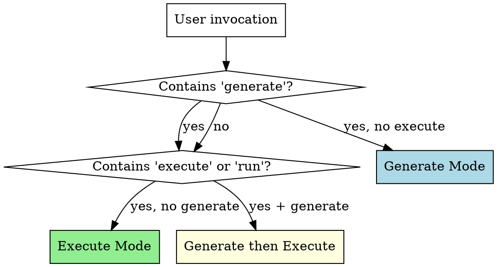

# Delphi

*The Oracle that foresees all outcomes.*

## Overview

Delphi generates comprehensive test scenarios — **guided cases** — for any software. It analyzes code, docs, specs, and running apps to produce structured Markdown test cases covering positive, negative, edge, accessibility, and security paths. Cases serve two audiences: human testers who walk through them step-by-step, and AI agents who execute them automatically.

**Core principle:** Exhaustive by default. Generate ALL scenarios. Users scope down, never up.

**Two modes:**
- **Generate** — analyze project context, discover testable surfaces, produce guided cases
- **Execute** — read generated cases, run them via browser automation or programmatic verification

## Mode Detection



| Invocation Pattern | Mode |
|-------------------|------|
| "Generate guided cases for X" | Generate |
| "Write test scenarios for X" | Generate |
| "Execute guided cases" / "Run guided cases" | Execute |
| "Test the guided cases" | Execute |
| "Generate and execute guided cases" | Generate, then Execute |
| Pipeline trigger (post-build) | Generate (+ Execute if browser available) |
| No guided cases exist yet + user says "test this" | Generate first, ask about Execute |

**Default behavior:** If guided cases don't exist yet, always Generate first. If they exist and user says "test" or "run", Execute.

## Guided Case Format

Every guided case MUST follow this exact template:

~~~markdown
# GC-XXX: [Descriptive Scenario Title]

## Metadata
- **Type**: positive | negative | edge | accessibility | performance | security
- **Priority**: P0 | P1 | P2
- **Surface**: ui | api | cli | background
- **Flow**: [logical flow name, e.g., "authentication", "checkout"]
- **Tags**: [comma-separated searchable tags]
- **Generated**: YYYY-MM-DD
- **Last Executed**: YYYY-MM-DD | never

## Preconditions

Bullet list of what must be true before this case starts. Each must be verifiable.

## Steps

Numbered steps. Each step has:
1. [Action description — what to do]
   - **Target**: [where — URL, element description, endpoint, command]
   - **Input** (if applicable): [what data to provide]
   - **Expected**: [what should happen — one or more expected outcomes]

## Success Criteria
- [ ] [Condition that must be true for this case to pass]

## Failure Criteria
- [Any ONE of these being true means the case failed]

## Notes
Optional. Known issues, environment requirements, things to watch for.
~~~

**Case ID convention:** `GC-XXX` — zero-padded sequential number, unique across the project.

**File naming:** `gc-XXX-short-description.md` — lowercase, hyphens, in a flow-specific subdirectory.

**Directory structure:**
```
tests/guided-cases/
  index.md
  [flow-name]/
    gc-001-description.md
    gc-002-description.md
```

---

## Generate Mode

Follow these steps in order. Do NOT skip steps. Do NOT start writing cases before completing surface discovery.

### Step 1: Context Gathering

Collect all available project context. Use these exact searches:

**Code structure:**
- Routes/pages: Glob for `**/pages/**`, `**/routes/**`, `**/app/**/page.*`, `**/app/**/layout.*`, `**/*router*`
- Components: Glob for `**/components/**/*.{tsx,jsx,vue,svelte,html}`
- API handlers: Glob for `**/api/**/*.{ts,js,py,go,rs}`, `**/controllers/**`, `**/handlers/**`, `**/routes/**/*.{ts,js}`
- CLI entry points: Glob for `**/bin/**`, `**/cli/**`, `**/commands/**`, `**/*cli*.*`
- Models/schemas: Glob for `**/models/**`, `**/schemas/**`, `**/types/**`, `**/entities/**`
- Config: Glob for `**/.env*`, `**/config/**`, `**/next.config*`, `**/vite.config*`, `**/tsconfig*`

**Documentation:**
- Read if they exist: `README.md`, `CLAUDE.md`, `docs/**/*.md`, `*.md` in project root
- API docs: `openapi.yaml`, `openapi.json`, `swagger.yaml`, `swagger.json`
- Design docs: `docs/plans/**/*.md`

**Recent changes:**
- Run: `git log --oneline -20` to see what was recently built
- Run: `git diff --stat HEAD~5` to see what files changed recently

**Existing test coverage:**
- Glob for `**/*.test.*`, `**/*.spec.*`, `**/tests/**`, `**/__tests__/**`, `**/test/**`
- Read a few test files to understand what's already covered

**Running app detection (if applicable):**
- Check common ports: `curl -s -o /dev/null -w "%{http_code}" http://localhost:3000` (also try 3001, 5173, 8080, 8000, 4200)
- If Chrome MCP tools are available AND app is running, navigate to it and take a screenshot for visual context

**User-provided context:**
- If the user specified a scope (e.g., "generate cases for auth"), focus context gathering on that area
- If the user provided docs or specs, read those first

After gathering, mentally summarize: what surfaces exist, what flows they form, and what's already tested.

### Step 2: Surface Discovery

From gathered context, build a surface map.

**Enumerate every testable surface:**

| Surface Type | How to Find | Example |
|-------------|-------------|---------|
| UI pages | Routes, page files, navigation components | `/login`, `/dashboard`, `/settings` |
| API endpoints | Route handlers, controller files, OpenAPI spec | `POST /api/auth/login`, `GET /api/users` |
| CLI commands | bin/ files, command handlers, --help output | `myapp init`, `myapp deploy --env prod` |
| Background jobs | Queue workers, cron configs, webhook handlers | `processPayments`, `sendEmailDigest` |

**Group surfaces into flows:**

A flow is a logical user journey that spans one or more surfaces. Examples:
- **authentication**: login page (UI) + `/api/auth/login` (API) + session management (background)
- **user-management**: settings page (UI) + `/api/users` (API) + profile update
- **checkout**: cart page → payment page → confirmation page (UI) + payment API + order processing (background)

Each surface can belong to multiple flows.

**Present the surface map to the user:**

After discovery, show the user what you found:

> **Surface Map:**
>
> **authentication** (3 surfaces)
> - UI: `/login`, `/register`, `/forgot-password`
> - API: `POST /api/auth/login`, `POST /api/auth/register`, `POST /api/auth/reset`
>
> **dashboard** (2 surfaces)
> - UI: `/dashboard`
> - API: `GET /api/stats`, `GET /api/recent-activity`
>
> [etc.]
>
> Should I generate guided cases for all flows, or focus on specific ones?

**Wait for user confirmation before proceeding to Step 3.** The user may want to scope down to specific flows.
